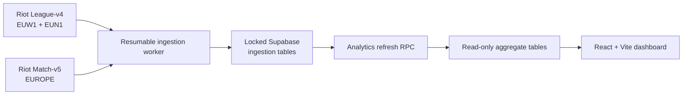

# Challenger Lens

Patch-scoped matchup evidence from recent EUW and EUNE Challenger games.

Challenger Lens is a portfolio project that combines an idempotent Riot API data pipeline, a security-conscious Supabase backend, and statistically cautious matchup analysis. It is designed to answer questions such as:

> Does Kassadin appear favored into Syndra among sampled Challenger mid-lane games this patch—and do gold, CS, and XP at 15 minutes support the result?

The app says “appears favored” rather than “is a counter.” It exposes sample size, uncertainty, player concentration, and conflicting lane signals so a small raw win rate cannot masquerade as a prediction.

## What it includes

- EUW1 and EUN1 Challenger Solo/Duo ladder snapshots
- Current-patch Ranked Solo match collection through Match-v5
- Match-ID deduplication when several tracked players share a game
- GPM, CSPM, KDA, and gold/CS/XP differences at 15 minutes
- Directional champion-vs-champion role matchups
- Common observed end-of-game item sets by matchup
- Shrunk win-rate estimates, Wilson intervals, baseline lift, and evidence labels
- Region, role, patch, champion, and minimum-sample filters
- A responsive React dashboard with live Supabase data and demo fallback
- Locked ingestion tables, public read-only aggregate tables, RLS tests, CI, and a resumable worker

## Architecture



A full Challenger timeline crawl can take far longer than a serverless request, so ingestion runs as a bounded, resumable Node process. Supabase is the backend and public API; the browser never receives the Riot or Supabase secret key. See [the architecture notes](docs/ARCHITECTURE.md) for the trade-offs.

## Run the dashboard

Requirements: Node 22.12+ and pnpm 11.19+.

```bash
pnpm install --frozen-lockfile
cp .env.example .env.local
pnpm dev
```

Set only these browser-safe values for the dashboard:

```dotenv
VITE_SUPABASE_URL=https://your-project-ref.supabase.co
VITE_SUPABASE_PUBLISHABLE_KEY=sb_publishable_your_key
```

Without valid Supabase values—or before live ingestion—the UI uses a clearly labeled synthetic dataset. Synthetic rows are never presented as Riot observations.

## Set up Supabase

The committed migration is the source of truth.

```bash
pnpm exec supabase login
pnpm exec supabase link --project-ref your-project-ref
pnpm exec supabase db push
```

For an isolated local Supabase stack, Docker is also required:

```bash
pnpm exec supabase start
pnpm exec supabase db reset
pnpm exec supabase test db
```

The schema follows a least-privilege split:

- ingestion tables have RLS enabled, no public policies, and no `anon`/`authenticated` privileges;
- `dataset_status`, `champion_stats`, `matchup_stats`, and `item_build_stats` explicitly grant public read access only;
- `refresh_public_analytics()` is `SECURITY INVOKER` and executable only by `service_role`.

## Run ingestion

First create a new Riot key. A key that has appeared in chat, logs, or Git history must be rotated. Put the replacement only in a local/host secret store:

```dotenv
SUPABASE_URL=https://your-project-ref.supabase.co
SUPABASE_SECRET_KEY=sb_secret_your_key
RIOT_API_KEY=RGAPI_your_rotated_key
MATCHES_PER_PLAYER=20
PLAYERS_PER_RUN=50
REQUEST_CONCURRENCY=2
```

Then run:

```bash
pnpm ingest
```

The worker discovers each realm's current patch, refreshes the two Challenger snapshots, resumes from its stored player cursor, respects `Retry-After`, rejects ineligible matches before requesting timelines, and refreshes the public aggregates after a successful batch.

For automation, add the three server secrets to GitHub Actions and set the repository variable `INGESTION_ENABLED=true`. Development keys expire every 24 hours and are for private development only; a public portfolio deployment needs a registered Riot product and production key.

## Statistical interpretation

The unit of analysis is one unique match and role, not one discovery path. Matchup win rate is shrunk toward that champion's patch/role baseline. The UI also shows a 95% interval, unique tracked players, top-player share, and the early-game differentials separately.

Completed-item win rates are descriptive, not recommendations: winning players have more gold and more chances to complete expensive builds. Read the full [methodology and limitations](docs/METHODOLOGY.md).

## Commands

| Command | Purpose |
| --- | --- |
| `pnpm dev` | Start the dashboard locally |
| `pnpm build` | Type-check and create a production build |
| `pnpm test` | Run deterministic analytics and transform tests |
| `pnpm typecheck` | Check browser and worker TypeScript |
| `pnpm ingest` | Run one resumable Riot ingestion batch |

## Data and policy notes

- Riot platform routes: `euw1` and `eun1`; both use the `europe` Match-v5 route.
- Only Ranked Solo/Duo queue 420 on Summoner's Rift is included.
- `info.gameVersion` is authoritative for the match cohort; Data Dragon realms are discovery/display metadata.
- Ladder membership means Challenger at collection time unless a prior snapshot proves otherwise.
- The dashboard provides aggregate post-game analysis, not live in-game decision instructions, hidden MMR, or raw-data redistribution.

Useful primary references: [Riot LoL API and policy](https://developer.riotgames.com/docs/lol), [Riot rate limits and key types](https://developer.riotgames.com/docs/portal), [Supabase RLS](https://supabase.com/docs/guides/database/postgres/row-level-security), and [Supabase API security](https://supabase.com/docs/guides/api/securing-your-api).

## Legal

Challenger Lens is not endorsed by Riot Games and does not reflect the views or opinions of Riot Games or anyone officially involved in producing or managing Riot Games properties. Riot Games and all associated properties are trademarks or registered trademarks of Riot Games, Inc.

MIT licensed. This license covers the source code, not Riot Games assets or data.
